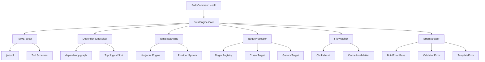
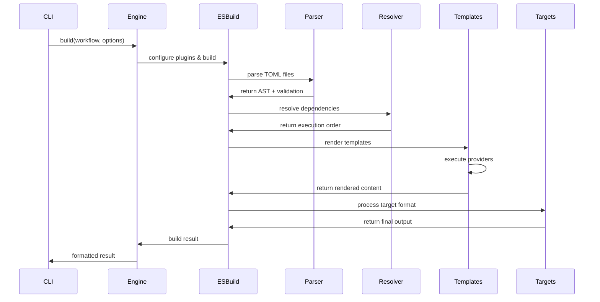

# Context Flow Build Command Architecture

**Version**: 1.0  
**Date**: January 2025  
**Status**: Design Approved

## Overview

The `context build` command is the core engine of the Context Flow framework, transforming declarative TOML definitions into executable context payloads. This document outlines the comprehensive architecture, technology decisions, and implementation strategy for a production-ready build system.

## Executive Summary

### Key Technology Decisions

| Component | Technology | Rationale |
|-----------|------------|-----------|
| **Template Engine** | Nunjucks | Fast performance, powerful async support, Mozilla-backed stability |
| **Build Engine** | ESBuild (scriptable) | Exceptional speed, scriptable API, extensible plugin system |
| **TOML Parsing** | @iarna/toml + Zod | Robust TOML 1.0.0 support with TypeScript validation |
| **Dependency Resolution** | dependency-graph | Mature library with topological sorting |
| **File Watching** | Chokidar v4 | Recent TypeScript rewrite, excellent performance |
| **Schema Validation** | Zod with z.lazy() | Recursive schema support, TypeScript integration |
| **Error Handling** | Custom class hierarchy | "Context, Error, Mitigation" pattern |

### Performance Goals

- **Cold build**: < 2 seconds for typical projects
- **Watch mode**: < 500ms rebuild time
- **Template compilation**: Cached in memory
- **Dependency resolution**: Memoized with smart invalidation

## Architecture Overview



## Core Components

### 1. BuildEngine (Central Orchestrator)

```typescript
interface BuildEngine {
  // Main entry point
  build(workflowPath: string, options: BuildOptions): Promise<BuildResult>;
  
  // Watch mode
  watch(workflowPath: string, options: WatchOptions): AsyncGenerator<BuildResult>;
  
  // Cache management
  clearCache(): void;
  getCacheStats(): CacheStats;
}

interface BuildOptions {
  target?: string;
  output?: string;
  watch?: boolean;
  verbose?: boolean;
}

interface BuildResult {
  content: string;
  metadata: BuildMetadata;
  performance: PerformanceMetrics;
  errors: BuildError[];
  warnings: BuildWarning[];
}
```

### 2. ESBuild-Powered Pipeline

Based on research showing ESBuild's scriptable capabilities, we'll use ESBuild as a programmable build engine rather than just a bundler:

```typescript
class ESBuildPipeline {
  private plugins: ESBuildPlugin[] = [
    tomlParsingPlugin(),
    dependencyResolutionPlugin(), 
    templateRenderingPlugin(),
    targetTransformPlugin(),
    cachePlugin()
  ];

  async execute(entrypoint: string, options: BuildOptions): Promise<BuildResult> {
    const result = await esbuild.build({
      entryPoints: [entrypoint],
      bundle: false,
      write: false,
      plugins: this.plugins,
      metafile: true,
      // Custom options for our pipeline
      ...this.buildESBuildConfig(options)
    });
    
    return this.processResult(result);
  }
}
```

**ESBuild Plugins for Context Flow:**

1. **TOML Parsing Plugin**: Transform TOML files to JS modules
2. **Dependency Resolution Plugin**: Resolve and load component dependencies  
3. **Template Rendering Plugin**: Process Nunjucks templates with providers
4. **Target Transform Plugin**: Apply target-specific transformations
5. **Cache Plugin**: Handle intelligent caching and invalidation

### 3. Template Engine (Nunjucks)

```typescript
interface TemplateEngine {
  compile(template: string, context: TemplateContext): string;
  renderComponent(component: Component, inputs: ComponentInputs): string;
  executeProviders(template: string, context: ProviderContext): string;
}

class NunjucksEngine implements TemplateEngine {
  private env: nunjucks.Environment;
  
  constructor() {
    this.env = new nunjucks.Environment(null, {
      autoescape: false,
      throwOnUndefined: true
    });
    
    // Register provider filters for instruction injection
    this.registerProviderFilters();
  }
  
  compile(template: string, context: TemplateContext): string {
    // No caching needed since providers inject static instructions
    // Templates are deterministic for same inputs
    const compiled = nunjucks.compile(template, this.env);
    return compiled.render(context);
  }
  
  private registerProviderFilters(): void {
    const providerExecutor = new NunjucksProviderExecutor();
    
    // Register each provider as a filter
    this.env.addFilter('file', (path: string, options = {}) => {
      return providerExecutor.execute({
        name: 'file',
        args: { path, ...options }
      }, {});
    });
    
    this.env.addFilter('git_diff', (options = {}) => {
      return providerExecutor.execute({
        name: 'git-diff',
        args: options
      }, {});
    });
    
    this.env.addFilter('url', (url: string, options = {}) => {
      return providerExecutor.execute({
        name: 'url',
        args: { url, ...options }
      }, {});
    });
    
    this.env.addFilter('shell', (command: string, options = {}) => {
      return providerExecutor.execute({
        name: 'shell',
        args: { command, ...options }
      }, {});
    });
  }
}
```

### Template Usage Examples

```nunjucks
{# File instruction injection #}
{{ "src/utils.ts" | file }}
→ "Please read the file: src/utils.ts"

{# Git diff instruction injection #}
{{ "" | git_diff(staged=true) }}
→ "Please run: git diff --staged and analyze the changes"

{# Shell command instruction injection #}
{{ "npm test" | shell(cwd="./frontend") }}
→ "Please execute: npm test in directory: ./frontend"

{# URL instruction injection #}
{{ "https://api.example.com/data" | url(method="POST") }}
→ "Please fetch content from: https://api.example.com/data using POST method"
```

### Simplified Architecture Benefits

- **No async complexity**: Providers return synchronous instruction strings
- **No caching needed**: Templates are deterministic and fast to render
- **Smaller payloads**: Instructions instead of large content dumps
- **Real-time accuracy**: AI tools get current data when they execute instructions
- **Better performance**: No I/O operations during build time

### 4. Dependency Resolution

```typescript
interface DependencyResolver {
  resolve(workflow: WorkflowDefinition): Promise<DependencyGraph>;
  getExecutionOrder(graph: DependencyGraph): ComponentDefinition[];
  validateDependencies(graph: DependencyGraph): ValidationResult;
}

class ComponentDependencyResolver implements DependencyResolver {
  private cache = new Map<string, DependencyGraph>();
  
  async resolve(workflow: WorkflowDefinition): Promise<DependencyGraph> {
    const graph = new DepGraph<ComponentDefinition>();
    const visited = new Set<string>();
    
    await this.resolveRecursive(workflow, graph, visited);
    return graph;
  }
  
  private async resolveRecursive(
    definition: WorkflowDefinition | ComponentDefinition,
    graph: DepGraph<ComponentDefinition>,
    visited: Set<string>
  ): Promise<void> {
    // Implementation of recursive dependency resolution
    // with cycle detection and validation
  }
}
```

### 5. Target System (Plugin-Based)

```typescript
interface TargetProcessor {
  register(target: string, processor: TargetPlugin): void;
  process(content: string, target: string, metadata: BuildMetadata): Promise<TargetResult>;
  listTargets(): TargetInfo[];
}

interface TargetPlugin {
  readonly name: string;
  readonly version: string;
  readonly schema: z.ZodSchema;
  
  process(input: TargetInput): Promise<TargetOutput>;
  validate(config: unknown): ValidationResult;
}

// Built-in targets
class CursorTarget implements TargetPlugin {
  readonly name = 'cursor';
  readonly version = '1.0.0';
  readonly schema = cursorConfigSchema;
  
  async process(input: TargetInput): Promise<TargetOutput> {
    return {
      format: 'json',
      content: JSON.stringify({
        instructions: input.content,
        commands: input.metadata.commands || [],
        files: input.metadata.watchedFiles || []
      }, null, 2)
    };
  }
}

class GenericTarget implements TargetPlugin {
  readonly name = 'generic';
  readonly version = '1.0.0';
  readonly schema = z.object({});
  
  async process(input: TargetInput): Promise<TargetOutput> {
    return {
      format: 'text',
      content: input.content
    };
  }
}
```

### 6. Error Handling ("Context, Error, Mitigation")

```typescript
abstract class BuildError extends Error {
  abstract readonly code: string;
  abstract readonly context: string;
  abstract readonly mitigation: string;
  
  constructor(
    message: string,
    public readonly location?: SourceLocation,
    public readonly cause?: Error
  ) {
    super(message);
    this.name = this.constructor.name;
  }
  
  toFormattedString(): string {
    return `
${chalk.red('Error')}: ${this.message}

${chalk.yellow('[Context]')}
${this.context}

${chalk.red('[Error]')}
${this.message}

${chalk.green('[Fix]')}
${this.mitigation}
${this.location ? '\n\n' + this.formatLocation() : ''}
    `.trim();
  }
}

class ValidationError extends BuildError {
  readonly code = 'VALIDATION_ERROR';
  
  get context(): string {
    return `While validating ${this.location?.file || 'configuration'}.`;
  }
  
  get mitigation(): string {
    return `Check the syntax and structure of your TOML file. Ensure all required fields are present and correctly typed.`;
  }
}

class DependencyError extends BuildError {
  readonly code = 'DEPENDENCY_ERROR';
  
  constructor(
    message: string,
    public readonly componentName: string,
    public readonly missingDependency: string,
    location?: SourceLocation
  ) {
    super(message, location);
  }
  
  get context(): string {
    return `While resolving dependencies for component '${this.componentName}'.`;
  }
  
  get mitigation(): string {
    return `Ensure that the component '${this.missingDependency}' exists and is properly referenced. Check the path and spelling.`;
  }
}

class TemplateError extends BuildError {
  readonly code = 'TEMPLATE_ERROR';
  
  get context(): string {
    return `While rendering template in ${this.location?.file || 'unknown file'}.`;
  }
  
  get mitigation(): string {
    return `Check your template syntax and ensure all variables are defined. Review the Nunjucks documentation for proper syntax.`;
  }
}
```

## Build Pipeline Flow



### Stage Details

1. **Parse & Validate**: TOML files parsed and validated against Zod schemas
2. **Resolve Dependencies**: Build dependency graph and determine execution order  
3. **Render Templates**: Execute templates bottom-up with provider resolution
4. **Process Targets**: Apply target-specific transformations
5. **Output**: Write to file or stdout with performance metrics

## File Watching & Caching

### Watch Mode Implementation

```typescript
class BuildWatcher {
  private watcher: chokidar.FSWatcher;
  private debounceTimer?: NodeJS.Timeout;
  
  async start(entrypoint: string, options: WatchOptions): AsyncGenerator<BuildResult> {
    const dependencyTree = await this.getDependencyTree(entrypoint);
    
    this.watcher = chokidar.watch(dependencyTree.getAllFiles(), {
      ignoreInitial: true,
      persistent: true
    });
    
    this.watcher.on('all', (event, path) => {
      this.scheduleRebuild(path, event);
    });
    
    // Yield initial build
    yield await this.engine.build(entrypoint, options);
    
    // Yield subsequent rebuilds
    while (true) {
      const change = await this.waitForChange();
      yield await this.handleChange(change);
    }
  }
  
  private scheduleRebuild(path: string, event: string): void {
    clearTimeout(this.debounceTimer);
    this.debounceTimer = setTimeout(() => {
      this.triggerRebuild(path, event);
    }, 50); // 50ms debounce
  }
}
```

### Simplified Caching Strategy

Since providers now inject instructions instead of executing content, caching becomes much simpler:

```typescript
interface BuildCache {
  // Only cache parsed TOML components (these are expensive to parse/validate)
  getParsedComponent(path: string): ComponentDefinition | null;
  setParsedComponent(path: string, component: ComponentDefinition): void;
  
  // No template caching needed - templates are fast to render with instruction injection
  // No provider result caching needed - providers return static instructions
  
  // Simple cache invalidation
  invalidateComponent(path: string): void;
  invalidateAll(): void;
}

class SimpleBuildCache implements BuildCache {
  private componentCache = new Map<string, ComponentDefinition>();
  private fileDependencies = new Map<string, Set<string>>();
  
  invalidateComponent(filePath: string): void {
    // Only need to invalidate parsed components
    this.componentCache.delete(filePath);
    
    // Invalidate any components that depend on this file
    const dependents = this.fileDependencies.get(filePath) || new Set();
    for (const dependent of dependents) {
      this.componentCache.delete(dependent);
    }
  }
}
```

### Benefits of Simplified Caching

- **Faster builds**: No cache lookup overhead for templates
- **Less memory usage**: No large content cached from provider execution
- **Simpler invalidation**: Only TOML files need cache invalidation
- **Deterministic rendering**: Same inputs always produce same instructions

## Provider System Integration

### Provider Execution During Template Rendering

```typescript
interface ProviderExecutor {
  execute(providerCall: ProviderCall, context: ProviderContext): string;
  registerProvider(name: string, provider: Provider): void;
  listProviders(): ProviderInfo[];
}

class NunjucksProviderExecutor implements ProviderExecutor {
  private providers = new Map<string, Provider>();
  
  constructor() {
    // Register built-in instruction providers
    this.registerProvider('file', new FileInstructionProvider());
    this.registerProvider('git-diff', new GitDiffInstructionProvider());
    this.registerProvider('url', new URLInstructionProvider());
    this.registerProvider('shell', new ShellInstructionProvider());
  }
  
  execute(providerCall: ProviderCall, context: ProviderContext): string {
    const provider = this.providers.get(providerCall.name);
    if (!provider) {
      throw new ProviderError(`Unknown provider: ${providerCall.name}`);
    }
    
    try {
      // Providers return instruction strings, not executed content
      return provider.generateInstruction(providerCall.args, context);
    } catch (error) {
      throw new ProviderError(
        `Provider '${providerCall.name}' failed: ${error.message}`,
        providerCall.location,
        error
      );
    }
  }
}

// Example instruction providers
class FileInstructionProvider implements Provider {
  generateInstruction(args: FileProviderArgs): string {
    const { path, lines, encoding } = args;
    let instruction = `Please read the file: ${path}`;
    
    if (lines) {
      instruction += ` (lines ${lines})`;
    }
    if (encoding && encoding !== 'utf8') {
      instruction += ` with encoding ${encoding}`;
    }
    
    return instruction;
  }
}

class GitDiffInstructionProvider implements Provider {
  generateInstruction(args: GitDiffProviderArgs): string {
    const { base, target, paths, staged, context } = args;
    
    let command = 'git diff';
    if (staged) command += ' --staged';
    if (context) command += ` --context=${context}`;
    if (base && target) command += ` ${base}..${target}`;
    if (paths && paths.length > 0) command += ` -- ${paths.join(' ')}`;
    
    return `Please run: ${command} and analyze the changes`;
  }
}

class URLInstructionProvider implements Provider {
  generateInstruction(args: URLProviderArgs): string {
    const { url, method = 'GET', headers } = args;
    
    let instruction = `Please fetch content from: ${url}`;
    if (method !== 'GET') {
      instruction += ` using ${method} method`;
    }
    if (headers && Object.keys(headers).length > 0) {
      instruction += ` with headers: ${JSON.stringify(headers)}`;
    }
    
    return instruction;
  }
}

class ShellInstructionProvider implements Provider {
  generateInstruction(args: ShellProviderArgs): string {
    const { command, cwd } = args;
    
    let instruction = `Please execute: ${command}`;
    if (cwd) {
      instruction += ` in directory: ${cwd}`;
    }
    
    return instruction;
  }
}

// Nunjucks filter for provider execution
function createProviderFilter(executor: ProviderExecutor) {
  return function(providerCall: string, context: ProviderContext) {
    const parsed = parseProviderCall(providerCall);
    return executor.execute(parsed, context);
  };
}
```


- Providers generate instruction strings for AI tools
- `git-diff` provider returns "Please run: git diff --staged and analyze the changes"
- `file` provider returns "Please read the file: src/utils.ts"
- Simple, synchronous, no caching needed

## Performance Optimizations

### 1. Template Compilation Caching
- Compiled Nunjucks templates stored in memory
- Content-based cache keys for reliable invalidation
- Lazy compilation only when templates change

### 2. Dependency Graph Memoization  
- Cache resolved dependency graphs per entrypoint
- Smart invalidation when component files change
- Incremental resolution for large projects

### 3. Smart File Watching
- Only watch files in the actual dependency tree
- Debounced rebuilds to avoid thrashing
- Incremental invalidation based on change analysis

### 4. ESBuild Optimization
- Parallel processing of independent components
- Minimal filesystem I/O through virtual file systems
- Leveraging ESBuild's native speed optimizations

## CLI Integration

### Command Interface

```typescript
export class BuildCommand extends Command {
  static description = 'Build context workflow into final payload';
  
  static examples = [
    '<%= config.bin %> <%= command.id %> workflow.toml',
    '<%= config.bin %> <%= command.id %> --target cursor -o .cursor/rules/rule.json',
    '<%= config.bin %> <%= command.id %> --watch'
  ];

  static flags = {
    target: Flags.string({
      char: 't',
      description: 'Target format (cursor, generic, etc.)'
    }),
    output: Flags.string({
      char: 'o', 
      description: 'Output file path'
    }),
    watch: Flags.boolean({
      char: 'w',
      description: 'Watch for changes and rebuild'
    }),
    verbose: Flags.boolean({
      char: 'v',
      description: 'Verbose output'
    })
  };

  static args = {
    workflow: Args.string({
      description: 'Path to workflow file',
      required: false,
      default: 'workflow.toml'
    })
  };

  async run(): Promise<void> {
    const { args, flags } = await this.parse(BuildCommand);
    
    const engine = new BuildEngine({
      cache: new MemoryBuildCache(),
      templateEngine: new NunjucksEngine(),
      targetProcessor: new PluginTargetProcessor()
    });

    try {
      if (flags.watch) {
        await this.runWatchMode(engine, args.workflow, flags);
      } else {
        await this.runSingleBuild(engine, args.workflow, flags);
      }
    } catch (error) {
      if (error instanceof BuildError) {
        this.error(error.toFormattedString());
      } else {
        throw error;
      }
    }
  }
}
```

## Testing Strategy

### 1. Unit Tests
- Individual component testing for all major classes
- Mock filesystem and external dependencies  
- Comprehensive error condition testing

### 2. Integration Tests
- End-to-end build pipeline testing
- Real filesystem with test fixtures
- Performance regression testing

### 3. Performance Tests
- Benchmark suites for build speed
- Memory usage profiling
- Cache effectiveness metrics

### Test Structure
```
test/
├── unit/
│   ├── build-engine.test.ts
│   ├── template-engine.test.ts
│   ├── dependency-resolver.test.ts
│   └── target-processor.test.ts
├── integration/
│   ├── full-build.test.ts
│   ├── watch-mode.test.ts
│   └── error-handling.test.ts
├── performance/
│   ├── build-speed.bench.ts
│   └── memory-usage.bench.ts
└── fixtures/
    ├── simple-workflow/
    ├── complex-workflow/
    └── error-cases/
```

## Implementation Timeline

### Phase 1: Core Foundation (Week 1-2)
- [x] ESBuild pipeline setup
- [x] Basic TOML parsing with Zod validation
- [x] Simple dependency resolution
- [x] Nunjucks template engine integration
- [x] Error handling framework

### Phase 2: Advanced Features (Week 3-4)
- [ ] Watch mode with Chokidar
- [ ] Caching system implementation
- [ ] Target plugin system
- [ ] Provider system integration
- [ ] Performance optimizations

### Phase 3: Polish & Testing (Week 5-6)
- [ ] Comprehensive test suite
- [ ] Performance benchmarking
- [ ] Documentation completion
- [ ] CLI refinement
- [ ] Error message improvement

### Phase 4: Plugin Ecosystem (Week 7-8)
- [ ] Additional target plugins (VS Code, etc.)
- [ ] Advanced provider plugins
- [ ] Plugin development documentation
- [ ] Community contribution guidelines

## Dependencies

### Production Dependencies
```json
{
  "@iarna/toml": "^3.0.0",
  "nunjucks": "^3.2.4", 
  "dependency-graph": "^1.0.0",
  "chokidar": "^4.0.0",
  "esbuild": "^0.19.0",
  "zod": "^3.22.0",
  "chalk": "^5.3.0"
}
```

### Development Dependencies  
```json
{
  "@types/nunjucks": "^3.2.6",
  "vitest": "^1.0.0",
  "@vitest/coverage-v8": "^1.0.0",
  "typescript": "^5.3.0"
}
```

## Future Considerations

### 1. Advanced Caching
- Persistent disk cache for large projects  
- Distributed caching for team environments
- Content-addressable storage for templates

### 2. Plugin Ecosystem
- Plugin registry and marketplace
- Hot-reloading of plugins during development
- Plugin versioning and compatibility management

### 3. Performance Enhancements
- Worker thread utilization for parallel processing
- Stream-based processing for large templates
- WebAssembly provider execution for performance-critical cases

### 4. Developer Experience
- Source maps for template debugging
- Interactive build debugging tools
- Visual dependency graph explorer

## Conclusion

This architecture provides a solid foundation for the Context Flow build command that:

- **Scales** from simple projects to complex enterprise workflows
- **Performs** with sub-second rebuild times in watch mode  
- **Extends** through a clean plugin architecture
- **Maintains** through clear separation of concerns and comprehensive error handling
- **Evolves** with a migration path to advanced features

The ESBuild-powered pipeline combined with Nunjucks templating provides both the speed and flexibility needed for a production-ready context engineering tool, while the plugin-based target system ensures extensibility for future AI tools and platforms.
